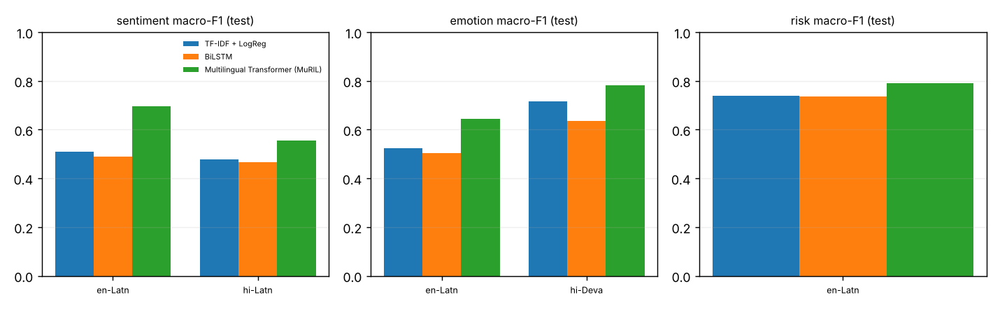
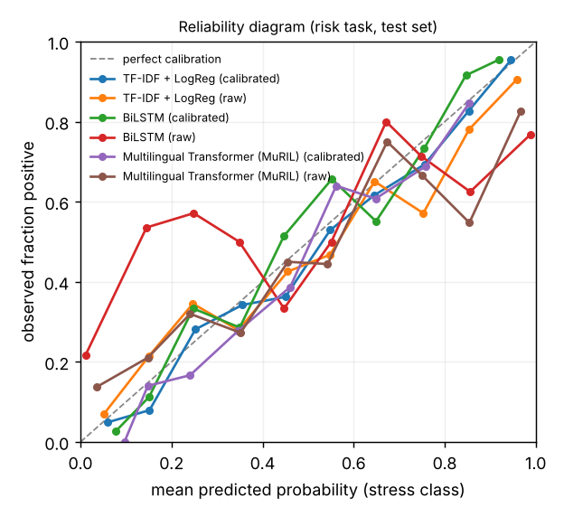

# Multilingual Mental-Health Risk & Sentiment Analyzer

A multi-task NLP **research / screening** system. For a piece of text it returns **sentiment**, **emotion**, a **stress-related distress-language signal** (with a calibrated model probability), **language + script**, and token-level **model attribution** - from three model families (TF-IDF + LogReg baseline, multi-task BiLSTM, multi-task MuRIL transformer) behind a FastAPI service and a research-dashboard UI.

> **This tool is an NLP research and screening system. It is not a medical diagnostic tool and should not be used to make clinical decisions.**
> It does not diagnose depression, anxiety, PTSD or any disorder, cannot tell whether a person has a mental illness, and makes no claim of clinical validity for suicide risk. Model probabilities are statistical model outputs, **not clinical probabilities**.

## What the "risk" output really is (read this first)

* The risk head is trained on **Dreaddit**: English Reddit post segments from stress-related communities, labelled **stress / non-stress** by crowd workers. So the output is a **stress-language signal**, wording: *"language associated with elevated distress"*.
* **No dataset here has suicide-risk or severity levels**, so the system has no such output and the "high-risk" safety message is wired in but can never fire (`HIGH_RISK_LABELS` is empty - unit-tested).
* Risk is **evaluated on English only.** There is no labelled mental-health data in Hindi/Hinglish in this project. For other languages the risk output is an *unvalidated zero-shot transfer*; the API sets `validated_for_language.risk=false` and the UI says so.
* The Hindi/Hinglish examples from the brief (e.g. *"Yaar kuch bhi karne ka mann nahi karta"*) **will run through the model**, but I cannot tell you how accurate the result is, because no labelled data exists to measure it.

## Datasets (details, licenses, caveats: [`DATASET.md`](DATASET.md))

| Task | Dataset | Languages with labels |
|---|---|---|
| Risk (stress language) | Dreaddit (Turcan & McKeown, 2019) | English |
| Sentiment (3-class) | Tweet Sentiment Multilingual (Barbieri et al., 2022) en + "hi" · Hinglish YouTube comments (community dataset) | English, **Romanized** Hindi / Hinglish |
| Emotion (6-label, multi-label) | BRIGHTER / SemEval-2025 Task 11 | English, Hindi (Devanagari) |

Three different populations; labels are never merged. Things I found by inspecting the data rather than trusting the cards:
1. The tweet dataset's `hindi` config is **Latin-script (Romanized/code-mixed) and partly plain English**, not Devanagari → tagged `hi-Latn`; no Devanagari sentiment data exists in the project.
2. BRIGHTER English has **no `disgust` annotation** → masked (not treated as 0) in loss and metrics.
3. BRIGHTER dev/test list every text **twice** (Track A/C copies) → deduplicated; 10 corrupted `#name?` rows dropped.
4. A first version of my dedup key stripped Devanagari vowel signs and wrongly collapsed Hindi sentences; a near-duplicate check missed punctuation variants. Both were found (by a unit test / inspection), fixed, and **all models were retrained from scratch on the corrected splits**.

## Architecture

```
text → clean/PII-mask → tokenizer (word-level | MuRIL WordPiece)
     → encoder (BiLSTM | MuRIL) → masked mean+max pooling
     → shared layer (Linear-GELU-Dropout)
         ├── sentiment head  (softmax, 3)    CE loss
         ├── emotion head    (sigmoid, 6)    masked BCE (+pos_weight)
         └── risk head       (softmax, 2)    CE loss
L_total = λ_sent·L_sent + λ_emo·L_emo + λ_risk·L_risk      (λ = 1,1,1 by default, `--loss-weights`)
```
Batches are task-homogeneous (each comes from one dataset). **Why share a trunk?** Sentiment and emotion are both affect-related and plausibly share lexical/semantic features; stress-in-Reddit-posts is a different construct from a different population, so it has its own head/loss. **Whether sharing helps here was not ablated** (no single-task control runs) - treat it as a design rationale, not a result. Probabilities are temperature-scaled on the validation split; emotion decision thresholds are tuned per label on validation.

Transformer: `google/muril-base-cased` (Apache-2.0; 237.6 M params; trained on 17 Indian languages incl. transliterated text). Chosen over XLM-R-base/mBERT for Indic + transliteration coverage; all three tokenizers and loading were verified, and CPU step time was benchmarked (MuRIL ≈ XLM-R, distil-mBERT ≈ 2.5× faster). I did **not** run a head-to-head of the encoders. License of weights per the model card; language coverage per the MuRIL paper (not independently verified).

## Results

All numbers are measured on held-out **test** splits by `scripts/evaluate.py` and rendered from `reports/metrics/*.json` by `scripts/results_markdown.py`. Single training run (seed 13). Bootstrap CIs (over test examples only; training-seed variance is *not* captured) are given for the headline metrics; the Hinglish split rests on 23 videos and the risk test set has 715 segments.

### Model comparison (test splits)

| Model | Params | Sentiment macro-F1 | Emotion macro-F1 | Risk F1 (stress) | Risk macro-F1 | Risk PR-AUC | Risk ROC-AUC | Risk ECE (cal.) | Risk ECE (raw) | Latency ms (CPU) |
|---|---|---|---|---|---|---|---|---|---|---|
| TF-IDF + LogReg | 1,159,030 | 0.489 | 0.612 | 0.760 | 0.740 | 0.843 | 0.826 | 0.039 | 0.060 | 3.9 |
| BiLSTM | 3,182,675 | 0.475 | 0.561 | 0.742 | 0.735 | 0.821 | 0.818 | 0.043 | 0.209 | 3.9 |
| Multilingual Transformer (MuRIL) | 237,952,523 | 0.611 | 0.690 | 0.807 | 0.790 | 0.830 | 0.848 | 0.033 | 0.125 | 89.2 |

### Macro-F1 by language / script (test)

| Task | Language (n) | baseline | bilstm | transformer |
|---|---|---|---|---|
| sentiment | en-Latn (870) | 0.509 | 0.491 | 0.696 |
| sentiment | hi-Latn (1343) | 0.478 | 0.466 | 0.557 |
| emotion | en-Latn (2759) | 0.525 | 0.503 | 0.644 |
| emotion | hi-Deva (1010) | 0.715 | 0.635 | 0.782 |
| risk | en-Latn (715) | 0.740 | 0.735 | 0.790 |

### Sentiment macro-F1 by source (test)

| Source | baseline | bilstm | transformer |
|---|---|---|---|
| tweets-english | 0.509 | 0.491 | 0.696 |
| tweets-hindi | 0.488 | 0.446 | 0.552 |
| youtube-hinglish | 0.464 | 0.496 | 0.558 |

### Emotion per-class F1 (test; English / Hindi)

| Model | Language | anger | disgust | fear | joy | sadness | surprise |
|---|---|---|---|---|---|---|---|
| baseline | en-Latn | 0.260 | n/a | 0.733 | 0.482 | 0.556 | 0.593 |
| baseline | hi-Deva | 0.691 | 0.789 | 0.773 | 0.689 | 0.581 | 0.768 |
| bilstm | en-Latn | 0.266 | n/a | 0.721 | 0.463 | 0.521 | 0.544 |
| bilstm | hi-Deva | 0.620 | 0.673 | 0.733 | 0.642 | 0.536 | 0.608 |
| transformer | en-Latn | 0.486 | n/a | 0.773 | 0.664 | 0.647 | 0.652 |
| transformer | hi-Deva | 0.656 | 0.757 | 0.816 | 0.835 | 0.757 | 0.874 |

### Calibration (temperature scaling fitted on validation)

| Model | Task | T | ECE raw → calibrated | Brier raw → calibrated |
|---|---|---|---|---|
| baseline | sentiment | 0.91 | 0.047 → 0.041 | 0.614 → 0.614 |
| baseline | emotion | 1.08 | 0.024 → 0.013 | 0.139 → 0.139 |
| baseline | risk | 1.37 | 0.060 → 0.039 | 0.348 → 0.342 |
| bilstm | sentiment | 8.21 | 0.392 → 0.033 | 0.884 → 0.627 |
| bilstm | emotion | 1.63 | 0.088 → 0.022 | 0.167 → 0.159 |
| bilstm | risk | 5.39 | 0.209 → 0.043 | 0.461 → 0.351 |
| transformer | sentiment | 1.81 | 0.094 → 0.052 | 0.528 → 0.516 |
| transformer | emotion | 1.16 | 0.030 → 0.009 | 0.126 → 0.125 |
| transformer | risk | 2.11 | 0.125 → 0.033 | 0.344 → 0.312 |


### Bootstrap 95% CIs (test examples resampled; training seed NOT varied)

| Model | Sentiment macro-F1 | Risk F1 | Risk PR-AUC |
|---|---|---|---|
| baseline | 0.488 [0.467, 0.511] | 0.760 [0.727, 0.794] | 0.843 [0.807, 0.875] |
| bilstm | 0.475 [0.455, 0.495] | 0.741 [0.706, 0.775] | 0.822 [0.782, 0.862] |
| transformer | 0.611 [0.590, 0.632] | 0.807 [0.774, 0.835] | 0.832 [0.785, 0.875] |

Paired differences vs. TF-IDF baseline (same resamples):

| Model | Δ Sentiment macro-F1 | Δ Risk F1 | Δ Risk PR-AUC |
|---|---|---|---|
| bilstm | -0.013 [-0.037, +0.010] | -0.019 [-0.048, +0.010] | -0.021 [-0.044, +0.000] |
| transformer | +0.123 [+0.097, +0.147] ✔ | +0.047 [+0.018, +0.079] ✔ | -0.010 [-0.045, +0.026] |

✔ = interval excludes 0. Latency = median single-text time for all three heads, CPU, 4 cores, measured with nothing else running.




Per-example errors (anonymised IDs, no text): [`reports/error_analysis.csv`](reports/error_analysis.csv) · summaries: `reports/metrics/error_summary.json` · language-ID: `reports/metrics/langid.json`.

## Key findings & honest interpretation

1. **The transformer clearly beats the baseline on sentiment (+0.12 macro-F1, CI excludes 0) and emotion (+0.08, both languages) and on risk F1 (+0.047, CI excludes 0).** But on risk **PR-AUC the transformer (0.832) is *not* better than TF-IDF (0.843)**: the difference is inside noise (Δ −0.010, CI [−0.045, +0.026]). The risk-F1 gain is mostly a recall gain at the fixed 0.5 threshold (recall 0.843 vs precision 0.774), i.e. a different operating point, not clearly better ranking. For the sensitive task, a 238 M-parameter model buys little over a 1 M-parameter bag-of-n-grams model except a modestly better ROC-AUC (0.848 vs 0.826) and 23× the latency (89 ms vs 4 ms).
2. **The BiLSTM adds no value over TF-IDF** on any task (differences vs baseline are negative and not significant; emotion is lower in both languages). With randomly-initialised embeddings and 2-6 K examples per task validation F1 plateaus around epoch 6 (≈0.59) while training loss keeps falling (2.5 → 0.41 over 12 epochs), i.e. it memorises rather than generalises (best epoch 11, only marginally above epoch 6). This is a negative result, reported as such; it also means the "shared-trunk BiLSTM" is not evidence that multi-task sharing helps (no single-task ablation was run).
3. **Calibration matters, mostly for the neural models.** Raw BiLSTM risk probabilities were badly over-confident (ECE 0.209 → 0.043 after temperature scaling, T = 5.4); the transformer improved 0.125 → 0.033 (T = 2.1). ECE on 715 examples is itself noisy, and Brier improvements are small - temperature scaling fixes confidence scale, not discrimination. Calibrated here ≠ clinically meaningful.
4. **Language gap (sentiment, transformer):** English 0.696 vs Hinglish/Romanized-Hindi 0.557 (−0.14); tweets-hindi 0.552 and YouTube-Hinglish 0.558. The two Hinglish sources are noisy (partly plain-English tweets; single-annotator comments). TF-IDF and BiLSTM are poor everywhere (≈0.47-0.51), so the multilingual pre-training is what carries Hinglish.
5. **Do not read "Hindi emotion (0.782) > English emotion (0.644)" as "Hindi is easier."** The two come from different annotation campaigns with very different label distributions (English `fear` is positive in 58 % of training rows, Hindi 15 %; English has no disgust labels; English `anger` F1 is only 0.49).
6. **Risk errors (transformer):** 91 false positives, 58 false negatives of 715 (precision 0.774, recall 0.843): about 1 in 4 flagged segments is a false alarm and ~16 % of stress-labelled segments are missed. Almost the entire risk test set is long text (693/715 ≥ 40 tokens), so the short-text behaviour of the risk head is untested. For sentiment, short texts (<8 tokens) err more (44 % vs 37 % medium).
7. **Sentiment ≠ stress.** On Dreaddit test segments, 83 % of truly-stressed segments get *negative* predicted sentiment vs 39 % of non-stress ones: correlated, but 17 % of stress segments are not negative. (Exploratory: the sentiment head was never validated on Reddit text.) Neutral is the weakest sentiment class (F1 0.53).
8. **Code-mixed/Hinglish:** evaluated as-is (original text, no normalisation) for sentiment only; no emotion or risk labels exist for Hinglish, so those heads are unmeasured there.

## Interpretability

`POST /predict {"explain": true}` (or the UI toggle) returns **Integrated Gradients** attributions over input embeddings for the stress-class score and the predicted sentiment. It is labelled *"Model attribution - not clinical reasoning"*. Attributions are approximate, can be unstable, and say what influenced this model's score, nothing about the author.

## Safety design

* Always-visible disclaimer; wording describes *language signals*, never "you have X".
* Elevated-signal notice: *"This result indicates language associated with elevated distress. This tool is not a medical diagnostic system."*
* Resources shown with an elevated signal are two **international directories only** (Find a Helpline; IASP crisis centres) - both fetched and confirmed on 2026-10-07. **No phone numbers are shipped** (they are country-specific and go stale); the user picks their own country. Re-verify the links before deployment.
* Unvalidated-language warnings (see above).

## Privacy

Submitted text is processed in memory and never logged, printed, or stored. `src/privacy.py` logs only whitelisted metadata (request ID, timestamp, route, status, latency, model version, language tag, risk label); any other field is dropped (unit-tested with a marker string across `/predict`, explain and batch). Validation errors don't echo input. Batch CSVs are read into memory and discarded (nothing is written to disk; results CSV is built in the browser); size/row limits apply; spreadsheet-formula injection in echoed IDs is neutralised. `data/`, checkpoints, uploads and logs are git-ignored. Identifiers (emails, phones, URLs, @mentions) are masked before text reaches a model. No user text is sent to any external service; the optional Sarvam adapter only runs if you call it and set `SARVAM_API_KEY`.

## Quickstart

```bash
pip install -r requirements.txt
python scripts/download_data.py && python scripts/prepare_data.py     # raw data -> data/raw, data/processed (git-ignored)
python scripts/train_baseline.py && python scripts/train_langid.py
python scripts/train_lstm.py                                          # ~15 min on 4 CPU cores
python scripts/train_transformer.py                                   # hours on CPU; use a GPU if you have one
python scripts/evaluate.py                                            # metrics, calibration, error analysis -> reports/
uvicorn src.app.main:app_factory --factory --port 8000                # http://127.0.0.1:8000
python -m pytest -q                                                   # no GPU, no downloads, no real training
python scripts/train_lstm.py --smoke                                  # 2-epoch pipeline check on a 64-example subset
python scripts/train_transformer.py --smoke                           # same, tiny random encoder (not a real model)
```
Smoke runs write to `checkpoints/smoke_*` and are not real models. Device is auto-detected (CUDA / MPS / CPU; `--device` to override). Configurable: `--epochs --batch-size --lr --max-len --patience --seed --limit --loss-weights`.

### API
```
GET  /            service info (JSON if Accept: application/json, else the dashboard)
GET  /health
POST /predict     {"text": "...", "model": "transformer|bilstm|baseline", "language": "auto|en-Latn|hi-Deva|hi-Latn", "explain": false}
POST /api/compare {"text": "..."}               (playground; BiLSTM vs transformer)
POST /api/batch   multipart CSV (text[,id,language]) → JSON, or format=csv
UI: / /analyze /playground /models /languages /errors /batch /health-ui /about
```
Response (abridged): `language, script, language_tag, sentiment, emotion, risk, risk_signal, risk_probability, risk_predictions[], model, inference_latency_ms, validated_for_language{}, safety{}`.

## Repository layout
```
src/{config,preprocessing,langid,safety,privacy,explain,inference}.py
src/data/{download,prepare,datasets}.py      src/models/{baseline,multitask,tokenization,io}.py
src/training/{trainer,metrics,calibration,predict,run}.py      src/evaluation/{adapters,evaluate,report}.py
src/app/{main,reports}.py + templates/ static/      src/integrations/sarvam.py
scripts/  tests/  reports/  DATASET.md
```
Committed artefacts: `reports/` (metrics JSON, per-example predictions and `error_analysis.csv` with anonymised IDs and **no raw text**, figures). Not committed: data, checkpoints, logs.

## Limitations (please read)
* The transformer's best validation epoch was its last (3 of 3, time-capped on CPU, no early stop triggered), so it is probably **under-trained**; more epochs / tuning might change the comparison (and no hyper-parameter search was done for any model beyond TF-IDF's C).
* One training seed per model (bootstrap CIs cover test-sample noise only); small test sets (esp. Hinglish: 23 videos, single annotator).
* Risk = stress in English Reddit text; weak proxy for anything clinical; community/topic confound; performance on other populations unknown.
* Sentiment F1 is modest everywhere - three-class tweet sentiment with ~1.8 K examples per language is hard, and the Hinglish labels are noisy.
* Hindi (Devanagari) has emotion labels only; sentiment/risk on Devanagari input are zero-shot and unvalidated. Hinglish has sentiment labels only. Other Indic languages (Bengali, Tamil, Telugu, Kannada, Malayalam) are **not supported or evaluated**: script detection works, but nothing else is measured.
* Romanized-Hindi detection is a small classifier trained on one YouTube corpus (style confound; see `reports/metrics/langid.json`).
* **Code-mixed normalisation/transliteration was not implemented**, so no "original vs normalised input" comparison exists; code-mixed text is fed to the multilingual model as-is.
* Sarcasm cannot be identified from the available labels, so it is not analysed.
* Same-author leakage can't be excluded (no author metadata); no cross-dataset benchmark-contamination audit.
* The Sarvam adapter is unit-tested with mocked HTTP only - **never run against the live service**. TTS is not implemented.
* Dreaddit's license is **not verified**; tweets are subject to Twitter's terms. Check before any redistribution or commercial use.
